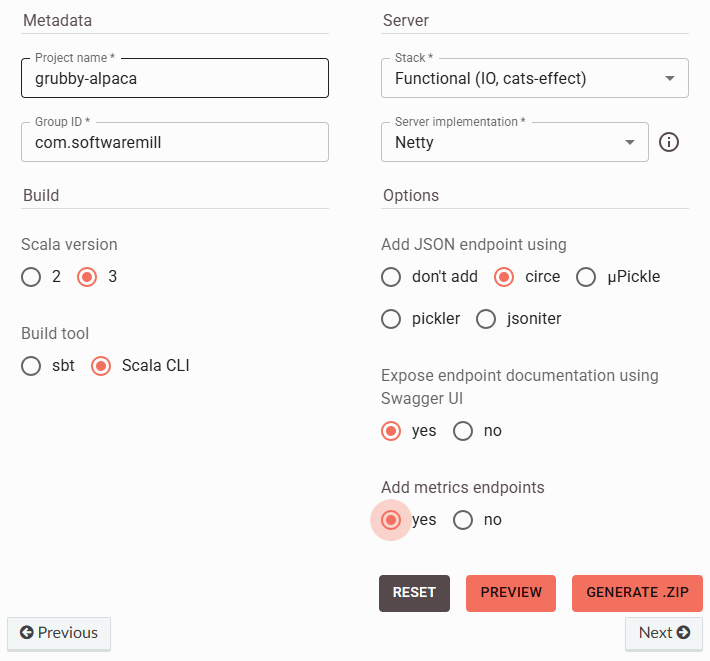
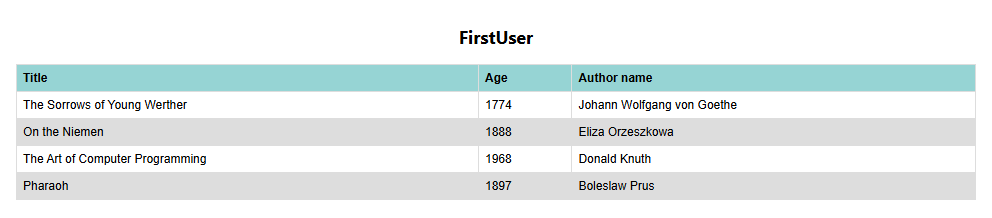

# Create a fullstack project using Scala3, Tapir, Circe, OpenApi, React, Typescript

## Generate Scala server
[tapir project generation](#tapir_project_generation)



It is enough to start with. Also it adds two get endpoints, user and getBooks(called differently). 

## Generate React(typescript) client
[CreateReactApp](#CreateReactApp)

````shell
npx create-react-app client
cd client
npm start
````

## Do some useless stuff

Inside build.sbt I added the common block, however I am not using it as I want to detach from mixing scala stuff and FE stuff.
In this template both are separated projects. 

Also changed the name from sbtx to sbtw. 

For more details check the [sbtw usage](https://github.com/dwijnand/sbt-extras#sbt--h) page.
Otherwise, if sbt is already installed, you can use the standard commands:


## Deploy locally

### Deploy server

```shell
./sbtw -h # shows an usage of a wrapper script
./sbtw compile # build the project
./sbtw test # run the tests
./sbtw server/run # run the application (Main)
```

Or with sbt

```shell
sbt compile # build the project
sbt test # run the tests
sbt server/run # run the application (Main)
```

### Deploy client

````shell
npm install
npm start
````

I build two components to handle user and getBooks endpoints and display the content. 
For this I followed this tutorial: [Fetch_data_with_React_Hooks_and_Typescript](#Fetch_data_with_React_Hooks_and_Typescript)

You can also access the OpenApi at this link, however sbt is going to show these details:
http://localhost:9000/docs/#/

## The result



## Links:
##### [tapir_project_generation](https://tapir.softwaremill.com/en/latest/generate.html)
##### [tapir_documentation](https://tapir.softwaremill.com/en/latest/)
##### [tapir_github](https://github.com/softwaremill/tapir)
##### [bootzooka: template microservice using tapir](https://softwaremill.github.io/bootzooka/)
##### [sbtw_wrapper](https://github.com/dwijnand/sbt-extras#installation)
##### [CreateReactApp](https://create-react-app.dev/docs/getting-started/)
##### [sbt](https://www.scala-sbt.org)
##### [Fetch_data_with_React_Hooks_and_Typescript](https://dev.to/camilomejia/fetch-data-with-react-hooks-and-typescript-390c)